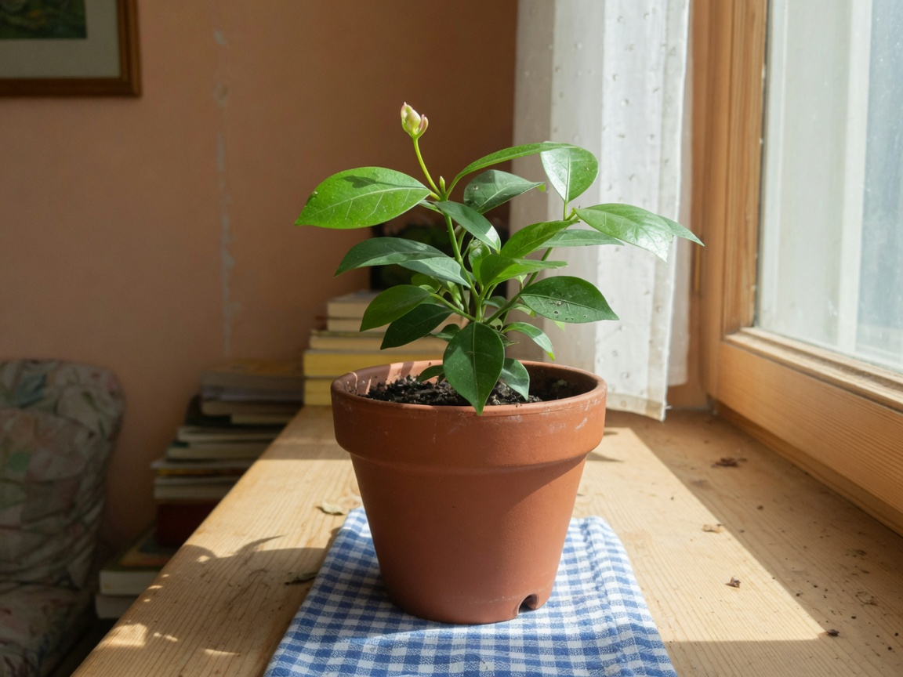

# Claude Fable 5 — Plant Care Stream



An interactive simulation of an autonomous AI agent maintaining a living plant over long periods of time.

## Overview

Claude Fable 5 is given a single ongoing responsibility: keep one plant alive. It makes decisions in real time about watering, light, pruning, and storytelling based on the plant's current state.

The simulation runs continuously with persistent state. Close the tab and return later — time will have passed and the plant's condition will have evolved accordingly.

This demo uses a real photograph of the plant along with live sensor-style data and a history chart.

## Live Demo

**https://nostalgicgarethdev.github.io/claude-fable-5**

## Features

- Fully autonomous decision making (water, sunlight, stories, rest, pruning)
- Real-time visual growth on the plant photograph (scaling + natural image adjustments)
- Persistent state across sessions (real elapsed time is simulated)
- Interactive chat with the agent
- Manual override controls
- Live sensor data and historical metrics chart

## Running Locally

```bash
open index.html
```

Keyboard shortcuts:
- **C** — Force an autonomous decision
- **?** — Focus the chat input

## Data & Persistence

All state (plant metrics, history, logs) is stored in the browser. The simulation advances based on actual wall-clock time when the page is reopened.